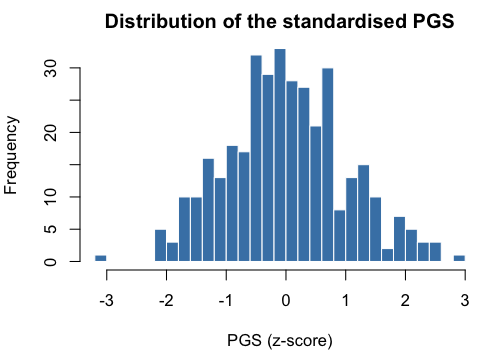
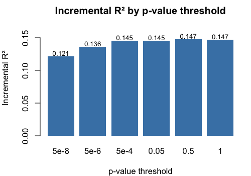

# Lab 6. Polygenic Scores with PRSice-2

In this lab we will learn how to construct and evaluate **polygenic scores (PGS)** using **PRSice-2** --- the most widely used tool for the clumping + thresholding (C+T) method. PRSice automates the pipeline we discussed in class: QC, clumping, scoring at multiple $p$-value thresholds, regression, and visualisation.

We will use the following data:

* `1kg_hm3` genotypes (2,504 individuals, $\sim$1.4M HapMap3 SNPs) as the **target sample**
* `Trait2.ma` --- GWAS summary statistics from $\sim$350K UK Biobank European participants as the **base (discovery) sample**
* `1kg.Trait2.phen` --- a simulated polygenic phenotype aligned to the 1000 Genomes individuals

The lab covers:

* Installing PRSice-2 on Google Cloud Shell
* Running a full C+T pipeline in one command
* Comparing PGS $R^2$ at different $p$-value thresholds
* Incremental $R^2$ and bootstrap confidence intervals in R
* Cross-ancestry PGS portability

---

## 0. Getting started

Open Google Cloud Shell. Large data files in the repo are stored via **Git LFS**, which may not be installed by default — install it once per Cloud Shell session:

```bash
sudo apt-get update && sudo apt-get install -y git-lfs
git lfs install
```

Clone the course repository (or refresh it if already present):

```bash
cd ~
if [ -d ~/sociogenomics_2025_2026/.git ]; then
  cd ~/sociogenomics_2025_2026 && git pull
else
  rm -rf ~/sociogenomics_2025_2026
  git clone https://github.com/nicolabarban/sociogenomics_2025_2026.git
fi
```

Then enter the repository and fetch the LFS files:

```bash
cd ~/sociogenomics_2025_2026
git lfs pull
```

Create the working directories:

```bash
cd $HOME
mkdir -p ~/Sociogenomics/Data ~/Sociogenomics/Results ~/Sociogenomics/Scripts ~/Sociogenomics/Software
```

If you want to start from a clean state, wipe any previous data first:

```bash
rm -rf ~/Sociogenomics/Data/*
```

### Copy all lab data from the course repo

All files needed for this lab --- the 1000 Genomes HapMap3 genotypes, summary statistics, phenotype, and population info --- are in the course repository under `data/` (large files are handled via Git LFS, so make sure you ran `git lfs pull` above). Copy them into your working data directory in one go:

```bash
cp ~/sociogenomics_2025_2026/data/1kg_hm3.* \
   ~/sociogenomics_2025_2026/data/1kg_hm3_QC_CEU.* \
   ~/sociogenomics_2025_2026/data/1kg_pca.eigenvec \
   ~/sociogenomics_2025_2026/data/1kg_pca.eigenval \
   ~/sociogenomics_2025_2026/data/Trait2.ma \
   ~/sociogenomics_2025_2026/data/1kg.Trait2.phen \
   ~/sociogenomics_2025_2026/data/1kg-sample-2504-phased.txt \
   ~/sociogenomics_2025_2026/data/EUR.id \
   ~/sociogenomics_2025_2026/data/BMI_pheno.txt \
   ~/sociogenomics_2025_2026/data/score_rs9930506.txt \
   ~/Sociogenomics/Data/
```

Check they are there:

```bash
ls ~/Sociogenomics/Data/1kg_hm3.* \
   ~/Sociogenomics/Data/Trait2.ma \
   ~/Sociogenomics/Data/1kg.Trait2.phen \
   ~/Sociogenomics/Data/EUR.id \
   ~/Sociogenomics/Data/1kg-sample-2504-phased.txt
```

> **Note:** The summary statistics come from a GWAS of a simulated polygenic trait on $\sim$350K UK Biobank European participants. The phenotype file has 2,504 simulated values aligned to the 1000 Genomes individuals.

### Install PRSice-2

PRSice-2 is a standalone binary distributed with an R wrapper:

```bash
cd ~/Sociogenomics/Software

# Download PRSice
wget https://github.com/choishingwan/PRSice/releases/download/2.3.5/PRSice_linux.zip
unzip PRSice_linux.zip

# Check it works
./PRSice_linux --help | head -20
```

Install R (if not already installed) and the packages PRSice needs:

```bash
sudo apt-get install -y r-base r-base-dev
R -e 'install.packages(c("ggplot2", "data.table", "optparse"), repos="https://cloud.r-project.org")'
```

Create symbolic links in the working directory for convenience:

```bash
cd ~/Sociogenomics
ln -sf ~/Sociogenomics/Software/PRSice.R
ln -sf ~/Sociogenomics/Software/PRSice_linux
```

Verify PLINK is still available (for QC):

```bash
plink --version
```

> **Note:** If PLINK is missing, run:
> ```bash
> bash ~/sociogenomics_2025_2026/scripts/setup_plink19.sh
> source ~/.bashrc
> ```

---

## Part I. Explore the data

Move into the data directory so the file names below work without typing full paths:

```bash
cd ~/Sociogenomics/Data
```

### Inspect the base (summary statistics) file

```bash
head Trait2.ma
wc -l Trait2.ma
```

The `.ma` format has columns: `SNP A1 A2 AF1 BETA SE P N`. This is the **base file** for PRSice.

**Question:** How many SNPs are in the summary statistics? How many reach genome-wide significance ($p < 5 \times 10^{-8}$)?

```bash
awk 'NR>1 && $7 < 5e-8' Trait2.ma | wc -l
```

### Inspect the target genotype data

```bash
wc -l 1kg_hm3.bim
wc -l 1kg_hm3.fam
```

**Question:** How many SNPs and how many individuals in the target sample?

### Inspect the phenotype

```bash
head 1kg.Trait2.phen
```

Three columns: `FID IID Trait2` (continuous, $h^2 \approx 0.2$).

---

## Part II. Reuse the QC files from Week 5

In Week 5 we already produced:

* `1kg_hm3_QC_CEU.{bed,bim,fam}` --- QC'd, European-only genotype file (full QC pipeline + `--keep 1kg_samples_EUR.txt`)
* `1kg_pca.eigenvec` --- 10 principal components

They are already in `~/Sociogenomics/Data/` thanks to the `cp` block in Section 0. Quick check:

```bash
ls ~/Sociogenomics/Data/1kg_hm3_QC_CEU.* ~/Sociogenomics/Data/1kg_pca.eigenvec
```

> **Reminder:** These files are pre-computed outputs of the Week 5 pipeline (QC + PCA on the European subset), distributed with the course repo so you can jump straight into the PGS analysis.

**Question:** How many SNPs and how many European individuals are in the QC'd file?

```bash
wc -l ~/Sociogenomics/Data/1kg_hm3_QC_CEU.bim
wc -l ~/Sociogenomics/Data/1kg_hm3_QC_CEU.fam
```

---

## Part III. A ``monogenic'' score: warm-up with FTO

Before building a full polygenic score, let's start from the simplest possible case: **a score based on a single SNP**.

We use **rs9930506** in the *FTO* gene --- the first and most replicated obesity-associated variant (Frayling et al.\ 2007, *Science*). Each copy of the A allele increases BMI by $\sim$0.4 kg/m² in adults of European ancestry.

Inspect the pre-made score file:

```bash
cat ~/Sociogenomics/Data/score_rs9930506.txt
```

It has three columns: `SNP A1 BETA`. Here just one line:

```
rs9930506 A 0.4
```

Compute the ``monogenic'' score in PLINK:

```bash
plink --bfile ~/Sociogenomics/Data/1kg_hm3_QC_CEU \
      --score ~/Sociogenomics/Data/score_rs9930506.txt 1 2 3 \
      --pheno ~/Sociogenomics/Data/BMI_pheno.txt \
      --out ~/Sociogenomics/Results/FTOscore
```

Inspect:

```bash
head ~/Sociogenomics/Results/FTOscore.profile
```

The `SCORE` column takes three values: 0, 0.2, or 0.4 --- one number per `A` allele copy, multiplied by the effect size (0.4).

> **Key idea:** a monogenic score is a special case of a polygenic score with only one SNP. This is why individual GWAS hits have almost no predictive power --- we need thousands of SNPs to explain meaningful variance.

---

## Part IV. The C+T method step by step with PLINK

Before jumping to PRSice, let us see what the **Clumping + Thresholding** (C+T) method does under the hood. It has three steps:

0. **Harmonise alleles:** remove ambiguous SNPs and flip strands if needed
1. **Clumping:** keep only one SNP per LD block (the most significant one)
2. **Thresholding + Scoring:** pick a $p$-value cut-off, then compute the weighted sum of alleles

### Step 0. Remove ambiguous SNPs

SNPs with **A/T** or **C/G** alleles are **ambiguous**: because one strand's A is the other strand's T, we cannot tell whether the effect allele in the base file matches the reference allele in the target file. These are typically **removed** before scoring.

A one-line `awk` is enough:

```bash
cd ~/Sociogenomics/Data

awk 'NR==1 || !($2$3=="AT" || $2$3=="TA" || $2$3=="CG" || $2$3=="GC")' \
    Trait2.ma > Trait2_clean.ma

wc -l Trait2.ma Trait2_clean.ma
```

Expected: $\sim$2,355 ambiguous SNPs removed (about 7% of the base file).

> **Note:** For non-ambiguous SNPs, PLINK's `--clump` and `--score` automatically handle simple allele swaps (i.e., when the base reports A1 as the effect allele and the target reports it as A2). Explicit strand flipping is only needed if base and target come from different genome builds or strand conventions --- which is not the case here.

### Step 1. Clump the cleaned summary statistics with PLINK

```bash
plink --bfile 1kg_hm3_QC_CEU \
      --clump Trait2_clean.ma \
      --clump-p1 1 \
      --clump-r2 0.1 \
      --clump-kb 250 \
      --clump-snp-field SNP \
      --clump-field P \
      --out ~/Sociogenomics/Results/Trait2_clumped
```

Flags:

| Flag | Meaning |
|---|---|
| `--clump-p1 1` | keep SNPs at all $p$-values (we apply the threshold later) |
| `--clump-r2 0.1` | remove SNPs with $r^2 > 0.1$ with the top SNP |
| `--clump-kb 250` | LD window of 250 kb |
| `--clump-snp-field / --clump-field` | column names in the base file |

Inspect the output:

```bash
wc -l ~/Sociogenomics/Results/Trait2_clumped.clumped
head ~/Sociogenomics/Results/Trait2_clumped.clumped
```

Extract the list of independent (clumped) SNPs:

```bash
awk 'NR>1 && $3 != "" {print $3}' \
    ~/Sociogenomics/Results/Trait2_clumped.clumped \
    > ~/Sociogenomics/Results/clumped_snps.txt

wc -l ~/Sociogenomics/Results/clumped_snps.txt
```

### Step 2. Build the score file at a given threshold

The score file needs three columns: `SNP A1 BETA`. We filter the summary statistics by both the clumped list **and** a $p$-value threshold. Start with genome-wide significance ($p < 5 \times 10^{-8}$):

```bash
awk 'NR==FNR {snps[$1]=1; next} FNR==1 {next} ($1 in snps) && $7 < 5e-8 {print $1, $2, $5}' \
    ~/Sociogenomics/Results/clumped_snps.txt \
    ~/Sociogenomics/Data/Trait2_clean.ma \
    > ~/Sociogenomics/Results/score_5e8.txt

wc -l ~/Sociogenomics/Results/score_5e8.txt
head ~/Sociogenomics/Results/score_5e8.txt
```

### Step 3. Compute the PGS with PLINK `--score`

```bash
plink --bfile 1kg_hm3_QC_CEU \
      --score ~/Sociogenomics/Results/score_5e8.txt 1 2 3 \
      --out ~/Sociogenomics/Results/Trait2_plink_5e8
```

The `1 2 3` tells PLINK: SNP ID is column 1, effect allele is column 2, effect size is column 3.

Inspect:

```bash
head ~/Sociogenomics/Results/Trait2_plink_5e8.profile
```

The `SCORE` column is the PGS for each individual.

### Exercise 1

1. How many ambiguous SNPs (A/T or C/G) were removed from `Trait2.ma`?
2. How many clumps did PLINK produce from the cleaned summary stats?
3. How many SNPs pass $p < 5 \times 10^{-8}$ among the clumped SNPs?
4. Repeat the `--score` step at a looser threshold (e.g., $p < 0.05$). Does the PGS distribution change? Does the correlation with the phenotype improve?

---

## Part V. PGS with PRSice-2 (automating C+T)

PRSice-2 automates the full C+T pipeline across many thresholds in one command:

1. Aligns SNPs between base and target
2. Clumps (LD $r^2 < 0.1$ in 250 kb windows)
3. Computes PGS at multiple $p$-value thresholds
4. Runs regression and reports $R^2$
5. Produces publication-ready plots

Run PRSice on Trait2:

```bash
cd ~/Sociogenomics

Rscript PRSice.R --dir . \
    --prsice ./PRSice_linux \
    --base ~/Sociogenomics/Data/Trait2.ma \
    --target ~/Sociogenomics/Data/1kg_hm3_QC_CEU \
    --snp SNP \
    --A1 A1 \
    --A2 A2 \
    --stat BETA \
    --pvalue P \
    --beta \
    --pheno ~/Sociogenomics/Data/1kg.Trait2.phen \
    --binary-target F \
    --bar-levels 5e-08,5e-06,5e-04,0.05,0.5,1 \
    --fastscore \
    --all-score \
    --out ~/Sociogenomics/Results/Trait2_PRSice
```

### Flags explained

| Flag | Meaning |
|------|---------|
| `--base` | Summary statistics (base sample) |
| `--target` | Target genotype data (PLINK binary) |
| `--snp/--A1/--A2` | Column names in the base file |
| `--stat BETA --beta` | Effect size is BETA (not OR) |
| `--pvalue P` | $p$-value column |
| `--pheno` | Target phenotype file |
| `--binary-target F` | Continuous phenotype |
| `--bar-levels` | $p$-value thresholds to test |
| `--fastscore` | Only compute at the specified thresholds (faster) |
| `--all-score` | Also save PGS for each individual at each threshold |
| `--out` | Output prefix |

### Inspect the output

```bash
ls ~/Sociogenomics/Results/Trait2_PRSice*
```

Key outputs:

| File | Content |
|------|---------|
| `*.summary` | Best threshold and $R^2$ |
| `*.prsice` | Results at each threshold |
| `*.all_score` | PGS for each individual at each threshold |
| `*_BARPLOT_*.png` | Barplot of $R^2$ by threshold |

View the summary:

```bash
cat ~/Sociogenomics/Results/Trait2_PRSice.summary
```

**Question:** Which $p$-value threshold gives the best $R^2$?

### The barplot

PRSice automatically produces a barplot of the incremental $R^2$ at each tested threshold:


The best threshold is highlighted in the darker colour.

### Exercise 2

1. What is the best $p$-value threshold for Trait2?
2. How many SNPs are included at that threshold?
3. What is the $R^2$ of the best PGS?
4. Compare the PGS from PRSice (`*.all_score`, column `Pt_5e.08`) with the PGS from the manual PLINK `--score` run at the same threshold. Are they identical up to scaling?

---

## Part VI. Analyse the PGS in R

Now we move to R for detailed analysis with covariates and bootstrap confidence intervals.

### Load the PGS scores

```r
# Load all scores at different thresholds
all_scores <- read.table("~/Sociogenomics/Results/Trait2_PRSice.all_score",
                         header = TRUE)
head(all_scores)
```

Columns (after R's automatic conversion of `-` to `.`):\
`FID IID Pt_5e.08 Pt_5e.06 Pt_0.0005 Pt_0.05 Pt_0.5 Pt_1` --- one PGS per threshold.

### Load phenotype and PCs

```r
pheno <- read.table("~/Sociogenomics/Data/1kg.Trait2.phen",
                    header = FALSE,
                    col.names = c("FID", "IID", "Trait2"))

pca_cols <- c("FID", "IID", paste0("PC", 1:10))
pca <- read.table("~/Sociogenomics/Data/1kg_pca.eigenvec",
                  header = FALSE, col.names = pca_cols)

# Merge
d <- merge(all_scores, pheno, by = c("FID", "IID"))
d <- merge(d, pca, by = c("FID", "IID"))
head(d)
```

### Standardise the PGS

```r
# Standardise each threshold's PGS to z-score
d$PGS_best <- scale(d[["Pt_0.5"]])   # replace with best threshold from PRSice
d$PGS_gw   <- scale(d[["Pt_5e.08"]])
d$PGS_all  <- scale(d[["Pt_1"]])
```

> **Note:** Column names in R replace `-` with `.` --- so `Pt_5e-08` becomes `Pt_5e.08`.

### Plot the PGS distribution

```r
hist(d$PGS_best, breaks = 30, col = "steelblue", border = "white",
     main = "Distribution of the standardised PGS",
     xlab = "PGS (z-score)")
```



**Question:** Is it approximately normal? This is the Central Limit Theorem at work.

### Regression: PGS predicting Trait2

```r
# Baseline model (PCs only)
mod0 <- lm(Trait2 ~ PC1 + PC2 + PC3 + PC4 + PC5 +
                     PC6 + PC7 + PC8 + PC9 + PC10, data = d)

# Full model (PCs + PGS)
mod1 <- lm(Trait2 ~ PGS_best + PC1 + PC2 + PC3 + PC4 + PC5 +
                    PC6 + PC7 + PC8 + PC9 + PC10, data = d)

# Compare
summary(mod1)$coefficients["PGS_best", ]

# Incremental R-squared
delta_r2 <- summary(mod1)$r.squared - summary(mod0)$r.squared
cat("R2 baseline (PCs):", round(summary(mod0)$r.squared, 4), "\n")
cat("R2 full (PCs+PGS):", round(summary(mod1)$r.squared, 4), "\n")
cat("Incremental R2:   ", round(delta_r2, 4), "\n")
```

### Compare all thresholds

```r
thresholds <- c("Pt_5e.08", "Pt_5e.06", "Pt_0.0005", "Pt_0.05", "Pt_0.5", "Pt_1")

results <- data.frame(threshold = thresholds, delta_r2 = NA)

for (i in seq_along(thresholds)) {
  d$tmp <- scale(d[[thresholds[i]]])
  mod <- lm(Trait2 ~ tmp + PC1 + PC2 + PC3 + PC4 + PC5 +
                      PC6 + PC7 + PC8 + PC9 + PC10, data = d)
  results$delta_r2[i] <- summary(mod)$r.squared - summary(mod0)$r.squared
}

print(results)

barplot(results$delta_r2, names.arg = results$threshold,
        col = "steelblue", border = NA, las = 2,
        main = "Incremental R² by p-value threshold",
        ylab = "Incremental R²")
```



### Bootstrap 95% confidence interval

```r
library(boot)
set.seed(12345)

rsq_fn <- function(data, indices) {
  ds <- data[indices, ]
  m0 <- lm(Trait2 ~ PC1 + PC2 + PC3 + PC4 + PC5 +
                    PC6 + PC7 + PC8 + PC9 + PC10, data = ds)
  m1 <- lm(Trait2 ~ PGS_best + PC1 + PC2 + PC3 + PC4 + PC5 +
                    PC6 + PC7 + PC8 + PC9 + PC10, data = ds)
  summary(m1)$r.squared - summary(m0)$r.squared
}

results_boot <- boot(data = d, statistic = rsq_fn, R = 1000)
boot.ci(results_boot, type = "norm")
```

### Exercise 3

1. What is the incremental $R^2$ of the best PGS?
2. What is the 95% bootstrap CI?
3. Does including more SNPs always improve $R^2$? What is the optimal threshold?
4. Repeat the analysis for `Trait1` (replace `Trait2.ma` and `1kg.Trait2.phen`). What do you observe? Why might the result be different?

---

## Part VII. Cross-ancestry portability (optional)

Compute the PGS on all individuals (not just Europeans) using the score file from Part III:

```bash
plink --bfile ~/Sociogenomics/Data/1kg_hm3 \
      --score ~/Sociogenomics/Results/score_5e8.txt 1 2 3 \
      --out ~/Sociogenomics/Results/Trait2_pgs_all_pops
```

> **Note:** We reuse the `score_5e8.txt` file we built manually in Part III.

In R, load the scores, merge with phenotype + population info, and compute $R^2$ by super-population:

```r
pgs_all <- read.table("~/Sociogenomics/Results/Trait2_pgs_all_pops.profile",
                      header = TRUE)
pheno_all <- read.table("~/Sociogenomics/Data/1kg.Trait2.phen",
                        header = FALSE,
                        col.names = c("FID", "IID", "Trait2"))
pop <- read.table("~/Sociogenomics/Data/1kg-sample-2504-phased.txt",
                  header = TRUE)

da <- merge(pgs_all[, c("FID", "IID", "SCORE")], pheno_all,
            by = c("FID", "IID"))
da <- merge(da, pop[, c("sample", "super_pop")],
            by.x = "IID", by.y = "sample")

for (p in c("EUR", "EAS", "SAS", "AFR", "AMR")) {
  sub <- da[da$super_pop == p, ]
  r2 <- cor(sub$SCORE, sub$Trait2)^2
  cat(p, ": R2 =", round(r2, 4), " (N =", nrow(sub), ")\n")
}
```

**Question:** In which population is the PGS most predictive? Least predictive? Why?

### Exercise 4 (optional)

1. Boxplot of PGS values by super-population --- any systematic shift?
2. Why is the PGS less accurate in African-ancestry populations?
3. What are possible solutions to improve cross-ancestry portability? (PRS-CSx, multi-ancestry GWAS, \ldots)

---

## Summary

In this lab we learned how to:

| Step | Tool | Command |
|------|------|---------|
| QC target sample | PLINK | `--mind --geno --maf --hwe` |
| PCA | PLINK | `--indep-pairwise`, `--pca` |
| PGS at multiple thresholds | PRSice-2 | `Rscript PRSice.R --bar-levels ...` |
| Inspect scores | bash | `cat *.summary; head *.all_score` |
| Incremental $R^2$ | R | `lm(y ~ PGS + PCs)` vs `lm(y ~ PCs)` |
| Bootstrap CI | R | `boot::boot()` |

**Key messages:**

* PRSice-2 automates C+T in one command
* Always control for ancestry PCs
* Report incremental $R^2$, not marginal
* Optimal $p$-value threshold is trait-specific
* PGS portability across ancestries is a key limitation
