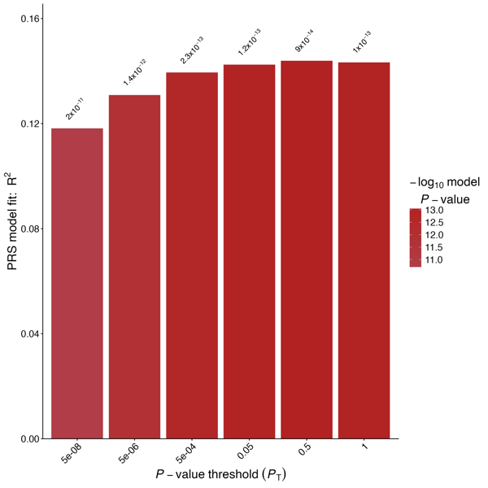
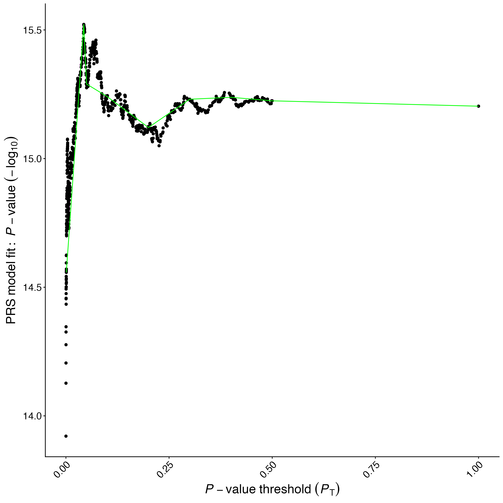

# Lab 6. Polygenic Scores with PRSice-2

In this lab we will learn how to construct and evaluate **polygenic scores (PGS)** using **PRSice-2** --- the most widely used tool for the clumping + thresholding (C+T) method. PRSice automates the pipeline we discussed in class: QC, clumping, scoring at multiple $p$-value thresholds, regression, and visualisation.

We will use the following data:

* `1kg_hm3` genotypes (2,504 individuals, $\sim$1.4M HapMap3 SNPs) as the **target sample**
* `Trait2.ma` --- GWAS summary statistics from $\sim$350K UK Biobank European participants as the **base (discovery) sample**
* `1kg.Trait2.phen` --- a simulated polygenic phenotype aligned to the 1000 Genomes individuals

The lab covers:

* Installing PRSice-2 on Google Cloud Shell
* Running a full C+T pipeline in one command
* Comparing PGS $R^2$ at different $p$-value thresholds
* Incremental $R^2$ and bootstrap confidence intervals in R
* Cross-ancestry PGS portability

---

## 0. Getting started

Open Google Cloud Shell. Large data files in the repo are stored via **Git LFS**, which may not be installed by default — install it once per Cloud Shell session:

```bash
sudo apt-get update && sudo apt-get install -y git-lfs
git lfs install
```

Then update the course repository and fetch the LFS files:

```bash
cd ~/sociogenomics_2025_2026
git pull
git lfs pull
```

Create the working directories:

```bash
cd $HOME
mkdir -p ~/Sociogenomics/Data ~/Sociogenomics/Results ~/Sociogenomics/Scripts ~/Sociogenomics/Software
```

If you want to start from a clean state, wipe any previous data first:

```bash
rm -rf ~/Sociogenomics/Data/*
```

### Copy all lab data from the course repo

All files needed for this lab --- the 1000 Genomes HapMap3 genotypes, summary statistics, phenotype, and population info --- are in the course repository under `data/` (large files are handled via Git LFS, so make sure you ran `git lfs pull` above). Copy them into your working data directory in one go:

```bash
cp ~/sociogenomics_2025_2026/data/1kg_hm3.* \
   ~/sociogenomics_2025_2026/data/Trait2.ma \
   ~/sociogenomics_2025_2026/data/1kg.Trait2.phen \
   ~/sociogenomics_2025_2026/data/1kg-sample-2504-phased.txt \
   ~/sociogenomics_2025_2026/data/EUR.id \
   ~/Sociogenomics/Data/
```

Check they are there:

```bash
ls ~/Sociogenomics/Data/1kg_hm3.* \
   ~/Sociogenomics/Data/Trait2.ma \
   ~/Sociogenomics/Data/1kg.Trait2.phen \
   ~/Sociogenomics/Data/EUR.id \
   ~/Sociogenomics/Data/1kg-sample-2504-phased.txt
```

> **Note:** The summary statistics come from a GWAS of a simulated polygenic trait on $\sim$350K UK Biobank European participants. The phenotype file has 2,504 simulated values aligned to the 1000 Genomes individuals.

### Install PRSice-2

PRSice-2 is a standalone binary distributed with an R wrapper:

```bash
cd ~/Sociogenomics/Software

# Download PRSice
wget https://github.com/choishingwan/PRSice/releases/download/2.3.5/PRSice_linux.zip
unzip PRSice_linux.zip

# Check it works
./PRSice_linux --help | head -20
```

Install R (if not already installed) and the packages PRSice needs:

```bash
sudo apt-get install -y r-base r-base-dev
R -e 'install.packages(c("ggplot2", "data.table", "optparse"), repos="https://cloud.r-project.org")'
```

Create symbolic links in the working directory for convenience:

```bash
cd ~/Sociogenomics
ln -sf ~/Sociogenomics/Software/PRSice.R
ln -sf ~/Sociogenomics/Software/PRSice_linux
```

Verify PLINK is still available (for QC):

```bash
plink --version
```

> **Note:** If PLINK is missing, run:
> ```bash
> bash ~/sociogenomics_2025_2026/scripts/setup_plink19.sh
> source ~/.bashrc
> ```

---

## Part I. Explore the data

### Inspect the base (summary statistics) file

```bash
head Trait2.ma
wc -l Trait2.ma
```

The `.ma` format has columns: `SNP A1 A2 AF1 BETA SE P N`. This is the **base file** for PRSice.

**Question:** How many SNPs are in the summary statistics? How many reach genome-wide significance ($p < 5 \times 10^{-8}$)?

```bash
awk 'NR>1 && $7 < 5e-8' Trait2.ma | wc -l
```

### Inspect the target genotype data

```bash
wc -l 1kg_hm3.bim
wc -l 1kg_hm3.fam
```

**Question:** How many SNPs and how many individuals in the target sample?

### Inspect the phenotype

```bash
head 1kg.Trait2.phen
```

Three columns: `FID IID Trait2` (continuous, $h^2 \approx 0.2$).

---

## Part II. Reuse the QC files from Week 5

In Week 5 we already produced:

* `1kg_hm3_QC_CEU.{bed,bim,fam}` --- QC'd, European-only genotype file (full QC pipeline + `--keep 1kg_samples_EUR.txt`)
* `1kg_pca.eigenvec` --- 10 principal components

Check they are present:

```bash
ls ~/Sociogenomics/Data/1kg_hm3_QC_CEU.* ~/Sociogenomics/Data/1kg_pca.eigenvec
```

If the files are missing, re-run the Week 5 QC pipeline:

```bash
plink --bfile ~/Sociogenomics/Data/1kg_hm3 \
      --autosome --snps-only \
      --mind 0.03 --geno 0.05 --maf 0.05 --hwe 1e-06 \
      --rel-cutoff 0.1 \
      --keep ~/Sociogenomics/Data/1kg_samples_EUR.txt \
      --make-bed --out ~/Sociogenomics/Data/1kg_hm3_QC_CEU
```

**Question:** How many SNPs and how many European individuals are in the QC'd file?

```bash
wc -l ~/Sociogenomics/Data/1kg_hm3_QC_CEU.bim
wc -l ~/Sociogenomics/Data/1kg_hm3_QC_CEU.fam
```

---

## Part III. PGS with PRSice-2

### The PRSice command

PRSice-2 automates the entire C+T pipeline in a single command:

1. Reads the GWAS summary statistics
2. Aligns SNPs between base and target
3. Clumps (LD $r^2 < 0.1$ in 250 kb windows)
4. Computes PGS at multiple $p$-value thresholds
5. Runs regression and reports $R^2$
6. Produces publication-ready plots

Run PRSice on Trait2:

```bash
cd ~/Sociogenomics

Rscript PRSice.R --dir . \
    --prsice ./PRSice_linux \
    --base ~/Sociogenomics/Data/Trait2.ma \
    --target ~/Sociogenomics/Data/1kg_hm3_QC_CEU \
    --snp SNP \
    --A1 A1 \
    --A2 A2 \
    --stat BETA \
    --pvalue P \
    --beta \
    --pheno ~/Sociogenomics/Data/1kg.Trait2.phen \
    --binary-target F \
    --bar-levels 5e-08,5e-06,5e-04,0.05,0.5,1 \
    --fastscore \
    --all-score \
    --out ~/Sociogenomics/Results/Trait2_PRSice
```

### Flags explained

| Flag | Meaning |
|------|---------|
| `--base` | Summary statistics (base sample) |
| `--target` | Target genotype data (PLINK binary) |
| `--snp/--A1/--A2` | Column names in the base file |
| `--stat BETA --beta` | Effect size is BETA (not OR) |
| `--pvalue P` | $p$-value column |
| `--pheno` | Target phenotype file |
| `--binary-target F` | Continuous phenotype |
| `--bar-levels` | $p$-value thresholds to test |
| `--fastscore` | Only compute at the specified thresholds (faster) |
| `--out` | Output prefix |

### Inspect the output

PRSice produces several files:

```bash
ls ~/Sociogenomics/Results/Trait2_PRSice*
```

Key outputs:

| File | Content |
|------|---------|
| `*.summary` | Best threshold and $R^2$ |
| `*.prsice` | Results at each threshold |
| `*.all_score` | PGS for each individual at each threshold |
| `*_BARPLOT_*.png` | Barplot of $R^2$ by threshold |
| `*_HIGH-RES_PLOT_*.png` | Fine-grained $R^2$ curve |

View the summary:

```bash
cat ~/Sociogenomics/Results/Trait2_PRSice.summary
```

**Question:** Which $p$-value threshold gives the best $R^2$?

### The barplot

PRSice automatically produces a barplot of the incremental $R^2$ at each tested threshold:



The best threshold is highlighted in the darker colour. For `Trait2` in our data, the best threshold is around $p < 0.05$ with $R^2 \approx 12\%$.

### High-resolution scan

Run PRSice again without `--fastscore` to scan many thresholds:

```bash
Rscript PRSice.R --dir . \
    --prsice ./PRSice_linux \
    --base ~/Sociogenomics/Data/Trait2.ma \
    --target ~/Sociogenomics/Data/1kg_hm3_QC_CEU \
    --snp SNP \
    --A1 A1 \
    --A2 A2 \
    --stat BETA \
    --pvalue P \
    --beta \
    --pheno ~/Sociogenomics/Data/1kg.Trait2.phen \
    --binary-target F \
    --interval 5e-05 \
    --lower 0.0001 \
    --out ~/Sociogenomics/Results/Trait2_PRSice_hires
```

This scans thresholds from $p = 10^{-4}$ upward in steps of $5\times10^{-5}$ and produces a continuous plot:



The peak identifies the optimal threshold for this trait and dataset.

### Exercise 2

1. What is the best $p$-value threshold for Trait2?
2. How many SNPs are included at that threshold?
3. What is the $R^2$ of the best PGS?
4. Look at the barplot and high-res plot. Does $R^2$ rise monotonically with threshold?

---

## Part IV. Analyse the PGS in R

Now we move to R for detailed analysis with covariates and bootstrap confidence intervals.

### Load the PGS scores

```r
# Load all scores at different thresholds
all_scores <- read.table("~/Sociogenomics/Results/Trait2_PRSice.all_score",
                         header = TRUE)
head(all_scores)
```

Columns (after R's automatic conversion of `-` to `.`):\
`FID IID Pt_5e.08 Pt_5e.06 Pt_0.0005 Pt_0.05 Pt_0.5 Pt_1` --- one PGS per threshold.

### Load phenotype and PCs

```r
pheno <- read.table("~/Sociogenomics/Data/1kg.Trait2.phen",
                    header = FALSE,
                    col.names = c("FID", "IID", "Trait2"))

pca_cols <- c("FID", "IID", paste0("PC", 1:10))
pca <- read.table("~/Sociogenomics/Data/1kg_pca.eigenvec",
                  header = FALSE, col.names = pca_cols)

# Merge
d <- merge(all_scores, pheno, by = c("FID", "IID"))
d <- merge(d, pca, by = c("FID", "IID"))
head(d)
```

### Standardise the PGS

```r
# Standardise each threshold's PGS to z-score
d$PGS_best <- scale(d[["Pt_0.5"]])   # replace with best threshold from PRSice
d$PGS_gw   <- scale(d[["Pt_5e.08"]])
d$PGS_all  <- scale(d[["Pt_1"]])
```

> **Note:** Column names in R replace `-` with `.` --- so `Pt_5e-08` becomes `Pt_5e.08`.

### Plot the PGS distribution

```r
hist(d$PGS_best, breaks = 30, col = "steelblue",
     main = "PGS distribution (best threshold)",
     xlab = "Standardised PGS")
```

**Question:** Is it approximately normal? This is the Central Limit Theorem at work.

### Regression: PGS predicting Trait2

```r
# Baseline model (PCs only)
mod0 <- lm(Trait2 ~ PC1 + PC2 + PC3 + PC4 + PC5 +
                     PC6 + PC7 + PC8 + PC9 + PC10, data = d)

# Full model (PCs + PGS)
mod1 <- lm(Trait2 ~ PGS_best + PC1 + PC2 + PC3 + PC4 + PC5 +
                    PC6 + PC7 + PC8 + PC9 + PC10, data = d)

# Compare
summary(mod1)$coefficients["PGS_best", ]

# Incremental R-squared
delta_r2 <- summary(mod1)$r.squared - summary(mod0)$r.squared
cat("R2 baseline (PCs):", round(summary(mod0)$r.squared, 4), "\n")
cat("R2 full (PCs+PGS):", round(summary(mod1)$r.squared, 4), "\n")
cat("Incremental R2:   ", round(delta_r2, 4), "\n")
```

### Compare all thresholds

```r
thresholds <- c("Pt_5e.08", "Pt_5e.06", "Pt_0.0005", "Pt_0.05", "Pt_0.5", "Pt_1")

results <- data.frame(threshold = thresholds, delta_r2 = NA)

for (i in seq_along(thresholds)) {
  d$tmp <- scale(d[[thresholds[i]]])
  mod <- lm(Trait2 ~ tmp + PC1 + PC2 + PC3 + PC4 + PC5 +
                      PC6 + PC7 + PC8 + PC9 + PC10, data = d)
  results$delta_r2[i] <- summary(mod)$r.squared - summary(mod0)$r.squared
}

print(results)

barplot(results$delta_r2, names.arg = results$threshold,
        col = "steelblue", border = NA, las = 2,
        main = "Incremental R2 by p-value threshold",
        ylab = "Incremental R2")
```

### Bootstrap 95% confidence interval

```r
library(boot)
set.seed(12345)

rsq_fn <- function(data, indices) {
  ds <- data[indices, ]
  m0 <- lm(Trait2 ~ PC1 + PC2 + PC3 + PC4 + PC5 +
                    PC6 + PC7 + PC8 + PC9 + PC10, data = ds)
  m1 <- lm(Trait2 ~ PGS_best + PC1 + PC2 + PC3 + PC4 + PC5 +
                    PC6 + PC7 + PC8 + PC9 + PC10, data = ds)
  summary(m1)$r.squared - summary(m0)$r.squared
}

results_boot <- boot(data = d, statistic = rsq_fn, R = 1000)
boot.ci(results_boot, type = "norm")
```

### Exercise 3

1. What is the incremental $R^2$ of the best PGS?
2. What is the 95% bootstrap CI?
3. Does including more SNPs always improve $R^2$? What is the optimal threshold?
4. Repeat the analysis for `Trait1` (replace `Trait2.ma` and `1kg.Trait2.phen`). What do you observe? Why might the result be different?

---

## Part V. Cross-ancestry portability (optional)

Compute the PGS on all 2,504 individuals (not just Europeans):

```bash
plink --bfile ~/Sociogenomics/Data/1kg_hm3 \
      --score ~/Sociogenomics/Results/Trait2_PRSice.snp 1 2 4 header \
      --out ~/Sociogenomics/Results/Trait2_pgs_all_pops
```

> **Note:** The `.snp` file from PRSice lists selected SNPs with effect allele and weight (columns 1, 2, 4).

In R, load the scores, merge with phenotype + population info, and compute $R^2$ by super-population:

```r
pgs_all <- read.table("~/Sociogenomics/Results/Trait2_pgs_all_pops.profile",
                      header = TRUE)
pheno_all <- read.table("~/Sociogenomics/Data/1kg.Trait2.phen",
                        header = FALSE,
                        col.names = c("FID", "IID", "Trait2"))
pop <- read.table("~/Sociogenomics/Data/1kg-sample-2504-phased.txt",
                  header = TRUE)

da <- merge(pgs_all[, c("FID", "IID", "SCORE")], pheno_all,
            by = c("FID", "IID"))
da <- merge(da, pop[, c("sample", "super_pop")],
            by.x = "IID", by.y = "sample")

for (p in c("EUR", "EAS", "SAS", "AFR", "AMR")) {
  sub <- da[da$super_pop == p, ]
  r2 <- cor(sub$SCORE, sub$Trait2)^2
  cat(p, ": R2 =", round(r2, 4), " (N =", nrow(sub), ")\n")
}
```

**Question:** In which population is the PGS most predictive? Least predictive? Why?

### Exercise 4 (optional)

1. Boxplot of PGS values by super-population --- any systematic shift?
2. Why is the PGS less accurate in African-ancestry populations?
3. What are possible solutions to improve cross-ancestry portability? (PRS-CSx, multi-ancestry GWAS, \ldots)

---

## Summary

In this lab we learned how to:

| Step | Tool | Command |
|------|------|---------|
| QC target sample | PLINK | `--mind --geno --maf --hwe` |
| PCA | PLINK | `--indep-pairwise`, `--pca` |
| PGS at multiple thresholds | PRSice-2 | `Rscript PRSice.R --bar-levels ...` |
| Inspect scores | bash | `cat *.summary; head *.all_score` |
| Incremental $R^2$ | R | `lm(y ~ PGS + PCs)` vs `lm(y ~ PCs)` |
| Bootstrap CI | R | `boot::boot()` |

**Key messages:**

* PRSice-2 automates C+T in one command
* Always control for ancestry PCs
* Report incremental $R^2$, not marginal
* Optimal $p$-value threshold is trait-specific
* PGS portability across ancestries is a key limitation
